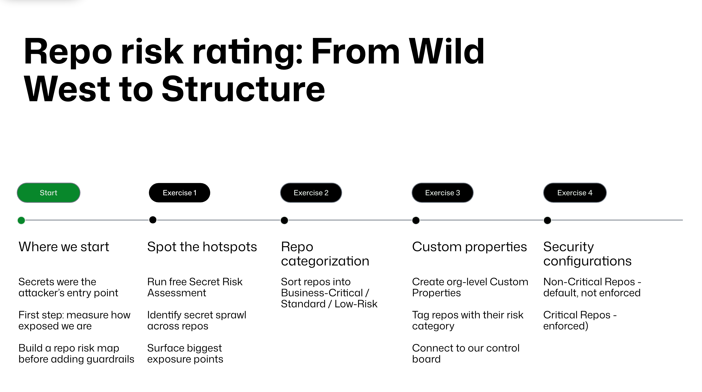

# Repo risk rating: From Wild West to Structure

Your team plays the role of the AppSec group at **Acme Corp**. A breach in the *Mona Gallery* SaaS application exposed plain‑text secrets in configuration files and vulnerable dependencies. Attackers phished a developer, cloned the main repository, discovered secrets, exploited outdated libraries and extracted customer data. Leadership wants to tighten security without hurting developer experience or hindering GitHub Copilot adoption. Your mission is to assess risk and implement controls aligned with NIST SSDF, SLSA and the upcoming Cyber Resilience Act.

Acme Corp's GitHub Enterprise setup currently consists of a single organization with 10 repositories and no centralized security controls. Each exercise in this workshop builds toward structured governance:

1. **Spot hot spots** - assess how much damage secrets can cause and where leaks are located.
2. **Categorize repositories** - decide which repositories are business‑critical and which are not.
3. **Add custom properties** - encode the categorization in GitHub so it can be used later.
4. **Create security configurations** - build two different sets of security configurations (critical vs. non‑critical) and connect them to your categorization.

## Exercise 1 - Spot the Hot Spots: Secret Risk Assessment

The **secret risk assessment** is a free on‑demand scan available to GitHub Team and Enterprise organizations. It examines the code in all repositories (including archived ones) and produces a report showing:

- **Total secrets**, **public leaks** and **preventable leaks** - aggregated counts of secrets exposed and how many leaks could be blocked by push protection  
- **Secret locations** - where secrets were found (code in branches, tags and archived repos)  
- **Secret categories** - distribution of partner secrets (e.g., API keys) and generic secrets like SSH keys or JWTs  
- **Repositories with leaks** - which repos contain the leaks

Read more about [secret risk assessment in our docs](https://docs.github.com/en/enterprise-cloud@latest/code-security/securing-your-organization/understanding-your-organizations-exposure-to-leaked-secrets/about-secret-risk-assessment).

Only organization owners or security managers can run the scan, and it can be generated once every **90 days**.

We have already triggered this scan on your organization before the session. Each participant receives a link to the finished report. Rather than running the scan yourself, focus on reviewing the results. Observe which Acme Corp. repositories contain leaked secrets and notice that many are the flagship projects (e.g., *mona‑gallery* and *mona*).

To run a similar security risk assessment on your own organization(s) after this workshop, you would need to:

1. Navigate to your organization's **Security** tab (under the organization header)  
2. In the sidebar under **Security**, click **Assessments**  
3. Click **Scan your organization** to start the assessment  
4. GitHub emails the organization owner when the report is ready

### Points to discuss

- The scan is **point‑in‑time** and does not continuously monitor; leaks found in the report could have been prevented if push protection had been enabled.
- The report counts secrets across public and private repos and provides categories of secrets and impacted repos, helping you prioritize remediation.
- The free assessment scans code only; GitHub Secret Protection (paid) extends scanning to pull requests, issues, wiki pages and discussions.

## Exercise 2 - Repository Categorization

Before applying security controls, decide which repositories are **business‑critical**, **standard** or **low risk**. This risk rating directly maps to how strong the security controls should be. For Acme, the team prepared a document listing each repository and its category. Review it and think about:

- **Critical (business‑critical)** - contains customer data, production infrastructure or is widely used (e.g., *mona‑gallery*, *mona*, *terragoat‑iac*). A compromise of these repos has severe impact.
- **Standard** - internal tools that support the business but aren't directly customer‑facing (e.g., *juice‑shop*, *moshi* library).
- **Low risk** - early‑stage experiments, documentation or configuration repos.

The following table summarizes each repository in the Acme Corp organization and assigns it to a risk tier (critical, standard, or low). These tiers are based on how important the repository is to the business and how severe the impact would be if it were compromised. Use this classification when creating custom properties and security configurations in later exercises.

| Repository | Risk tier | Reasoning |
| :---- | :---- | :---- |
| **mona‑gallery** | Critical | Main SaaS product; holds customer data and production code; high business impact if compromised. |
| **mono** | Critical | On‑prem variant of mona‑gallery; same functionality and criticality as the SaaS offering. |
| **terragoat‑iac** | Critical | Infrastructure‑as‑code templates deploying production environments; compromise could allow full environment control. |
| **juice‑shop** | Standard | Internal e‑commerce site for company swag; limited sensitive data; should follow secure coding but lower risk. |
| **WebGoat** | Low | Intentionally vulnerable web application for training; used for demonstrations, not part of Acme's services. |
| **moshi** | Standard | Internal JSON parsing library consumed by multiple projects; important to development but not customer‑facing. |
| **OpenAPI.NET** | Low | Fork of the OpenAPI.NET SDK; used for experimentation and library customization, not core to Acme's products. |
| **SecurityShepherd** | Standard | Security training platform used internally; contains practice exercises but not production code. |
| **JavaVulnerableLab** | Low | Intentionally vulnerable Java lab used for security training; not deployed in production. |
| **mission-control** | Standard | Central repository for GitHub settings and workflows; affects multiple repos but contains no direct customer data. |

### How to use this classification

For **Exercise 3** you will create custom properties for each risk tier (e.g., `critical`, `standard`, and `low`) and tag the repositories accordingly. When creating security configurations in **Exercise 4**, apply a stricter configuration to all critical repositories and a more flexible configuration to standard and low‑risk repositories.

## Exercise 3 - Creating Custom Properties

Custom properties add metadata to repositories so you can filter them later when applying rulesets or security configurations.

### Step 1 - Add custom properties for risk categories

1. In the upper‑right corner of GitHub, click your profile picture and choose **Organizations**.
2. Next to your organization, click **Settings**.
3. In the sidebar under **Code, planning, and automation -> Repository**, click **Custom properties**.
4. Click **New property**.
5. Enter a **Name** (no spaces) and optional description. For the workshop we recommend creating three boolean properties: `critical`, `standard` and `low`. Select **True/False (Boolean)** as the type. Leave the other options unchecked.
6. Click **Save property**.

**Alternative:** Instead of three booleans, you could define a single `risk-category` property with allowed values `critical`, `standard` and `low` (single select or multi select). This keeps metadata normalized and simplifies reporting.

### Step 2 - Set property values for repositories

1. Return to **Custom properties** in your organization settings.
2. Select the **Set values** tab.
3. Choose one or more repositories and click **Edit properties**.
4. In the dialog, set each property's value according to the categorization document and click **Save changes**.

After this exercise, each repository has metadata indicating whether it's critical, standard or low risk. You can search or filter repositories by these properties using the **Repositories** page (type `prop` in the search bar).

Read more about [custom properties in our docs](https://docs.github.com/en/enterprise-cloud@latest/organizations/managing-organization-settings/managing-custom-properties-for-repositories-in-your-organization).

## Exercise 4 - Building Security Configurations

Security configurations are collections of enablement settings for GitHub's security features (secret scanning, dependency scanning, code scanning and more). They let you apply the same settings to many repositories at once and optionally **enforce** those settings so repository admins cannot override them.

This exercise creates two configurations:

- **Critical repositories** - strict settings enabled and enforced.
- **Non‑critical repositories** - similar features enabled but not enforced (developers can adjust if needed).

### Step 1 - Create the **Critical** security configuration

1. Navigate to your organization settings and choose **Advanced Security -> Configurations**.
2. Click **New configuration**.
3. Provide a **Name** like *Critical repos* and a description explaining that it applies to business‑critical repositories.
4. Next to **GitHub Advanced Security features**, select **Include**.
5. Under **Secret Scanning**:  
   - Enable **Alerts** (this turns on secret scanning).
   - Enable **Validity checks** to reduce test if found secrets are still valid and help with prioritization.
   - Enable **Non‑provider patterns** to detect generic secrets like private keys.
   - Enable **Scan for generic passwords** to let Copilot detect passwords using AI.
   - Enable **Push protection** to block commits that contain secrets. Push protection proactively scans code during the push and prevents secrets from being committed.
     - Set **Bypass privileges** to `Specific actors` and select Repository admin. This would require an approval from an admin if a bypass of push protection block is required.
   - Enable **Prevent direct alert dismissals** to have better controls over dimissal of secret scanning alerts given the recent breach. This setting will require actors to submit requests for alert dismissals.
6. Under **Code Scanning**:  
   - Enable **Default setup** for CodeQL code scanning. CodeQL identifies vulnerabilities and errors in your code and displays results as alerts.
   - Next to **Runner type**, select **Standard** so we use the default GitHub-hosted runners.
   - Keep **Prevent direct alert dismissals** as `Not set` as we do not want to increase unnecessary friction with developers with the introduction of CodeQL.
7. Under **Dependency Scanning**:  
   - Ensure **Dependency graph**, **Automatic dependency submission**, **Dependabot alerts** and **Dependabot security updates** are enabled. The dependency graph analyzes the manifest/lock files to list dependencies and highlight vulnerabilities, and Dependabot alerts notify you when you depend on a vulnerable package. Dependabot security updates can automatically open pull requests to upgrade vulnerable dependencies.
8. Enable **Private vulnerability reporting** to receive reports from researchers for public OSS repositories.
9. In the **Policy** section, select **Use as default for newly created repositories** to `None` as we don't want to treat every new repository as **Critical** and set **Enforce configuration** to block repository owners from disabling any enabled features (`Enforce`).
10. Click **Save configuration**.

### Step 2 - Create the **Non‑critical** security configuration

Repeat the steps above to create a second configuration named *Non‑critical repos*.

Differences:

- Enable **Secret Protection**, **Push protection** and **Code Security** features as above.
- Leave **Enforce configuration** disabled. This gives teams flexibility to temporarily disable features if needed (consistent with the "no friction" mandate).
- Leave **Prevent direct alert dismissals** as `Not set` for both Secret Scanning and Code Scanning to avoid increasing friction for developers.
- Set the configuration as **default for all new repositories** as we want to treat most repos as non‑critical.

Read more about [security configurations in our docs](https://docs.github.com/en/code-security/securing-your-organization/introduction-to-securing-your-organization-at-scale/choosing-a-security-configuration-for-your-repositories).

### What have we done so far?

By the end of this exercise, you have:

- **Structured the "wild west"** - central governance exists through custom properties and security configurations.
- **Prepared security configurations** - you have created central security configurations for controlled rollout of the new policies.
- **Mapped risk categories to security configurations** - critical repos get strict enforcement; others receive recommended settings without enforcement.

## Security Passport checkpoint

Return to the [Security Passport](security-passport.md) and mark off the first section. You should have completed the following stamps:

- [x] 1. Classify your assets
