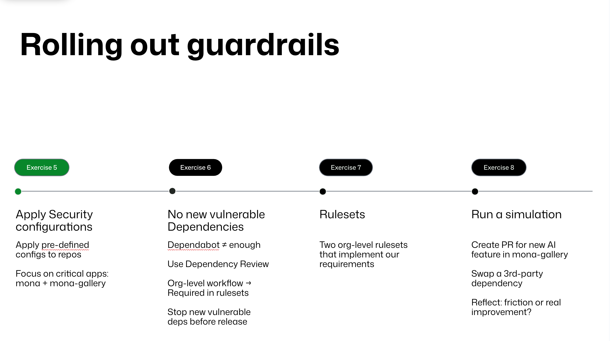
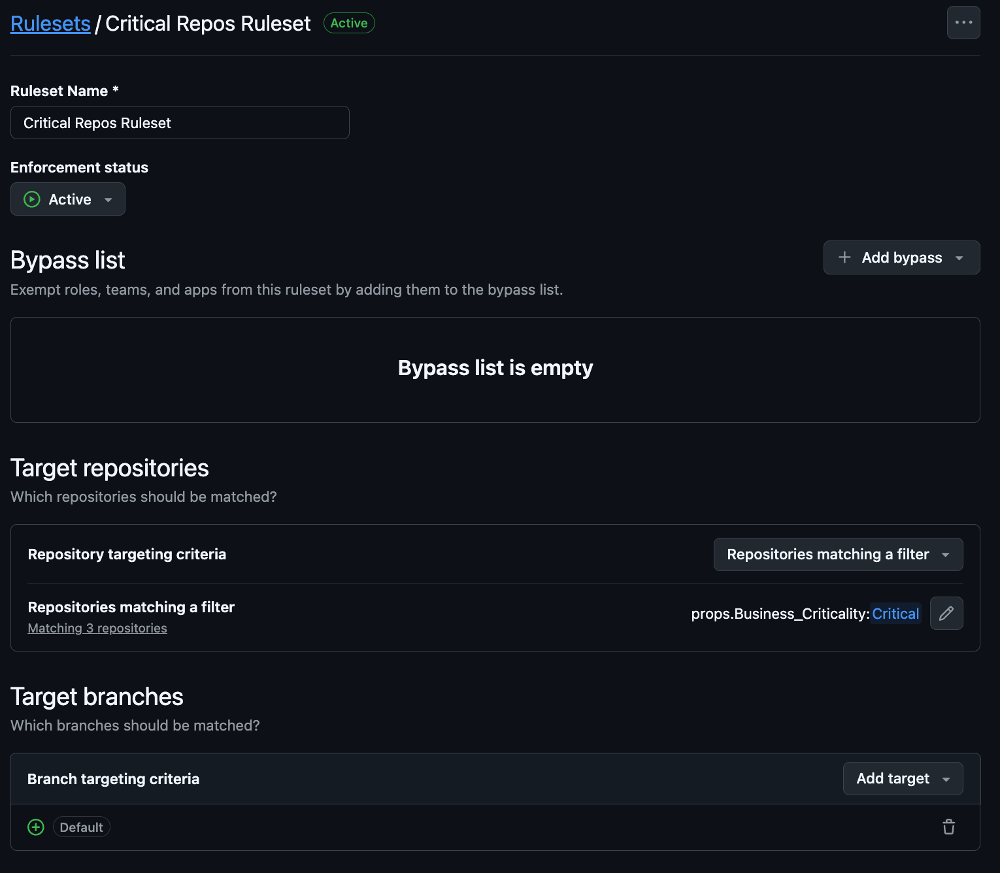
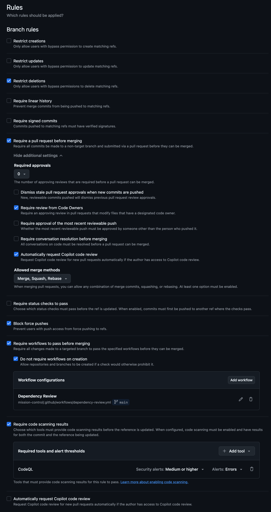
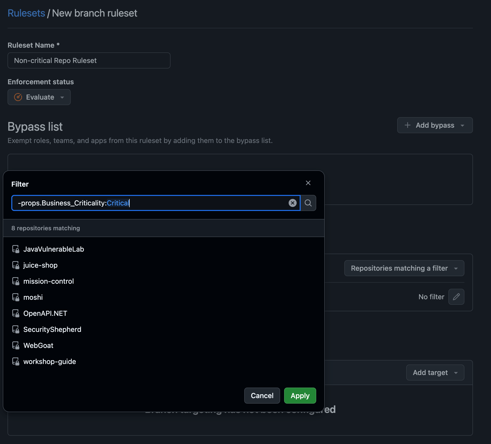

# Rolling out guardrails



## Exercise 5 - Apply the security configurations

Now that you've created **Critical** and **Non‑critical** security configurations and tagged each repository with a custom risk property, it's time to attach the configurations to the repositories.

### Step 1 - Apply the configurations using custom properties

1. Navigate to **Settings -> Security** for your organization and open **Advanced Security -> Configurations**.
2. In the **Apply configurations** table, filter repositories by their custom property. For example, type `props.Business_Criticality:Critical` in the search bar to list only critical repositories. Select these repositories and choose **Apply configuration -> Critical repos**. Repeat with `props.Business_Criticality:Standard` or `props.Business_Criticality:Low` for the *Non‑critical* configuration. When prompted, review license usage and click **Apply**.
3. Wait for the configurations to apply. You can see status indicators next to each repository.

> [!TIP]
> Filtering by custom properties allows you to apply configurations consistently without manually selecting each repository. GitHub's Rulesets feature, which we'll look at later, allows targeting by property as well.

Read more about [applying custom security configurations in our docs](https://docs.github.com/en/code-security/securing-your-organization/enabling-security-features-in-your-organization/applying-a-custom-security-configuration).

### Step 2 - Confirm the results on a sample repository

After applying the configurations, open the **mona-gallery** repository and check that the security features are now active.

1. Go to the repository's main page and click **Security**. You should see *Dependabot*, *Secret scanning* and *Code scanning* listed under **Vulnerability alerts**.
2. Click **Dependabot** and verify there are alerts (if any). You can filter the alerts and click an individual alert to view details. From the alert page you can create a security update pull request to fix a vulnerable dependency or dismiss the alert with a reason.
3. Click **Secret scanning**. Open an alert if present. To resolve an alert, rotate and revoke the leaked secret, then select **Close as** to record the appropriate reason and optionally add a comment.
4. Click **Code scanning**. Open a code scanning alert. If Copilot Autofix can suggest a fix, click **Generate fix**, then **Create PR with fix**. Alternatively, manually update the code and open a pull request. To dismiss an alert you decide not to address, click **Dismiss alert**, choose a reason and optionally add a comment.

### Discussion - Beyond initial scan

At this point you've configured scanning and are addressing vulnerabilities already present in your code. However, there is still nothing preventing developers from introducing new vulnerable dependencies in future pull requests. The next exercises introduce measures to block insecure dependencies at PR time and to enforce reviews and checks via rulesets.

## Exercise 6 - No new vulnerable dependencies

This exercise introduces the **dependency review action** and shows how to manage it centrally across your organization. The action scans pull requests for any changes to dependencies and fails the workflow if new dependencies have known vulnerabilities. You'll implement a central workflow that runs on every pull request and stops vulnerable dependencies from being merged.

Read more about the [dependency review action in our docs](https://docs.github.com/en/enterprise-cloud@latest/code-security/supply-chain-security/understanding-your-software-supply-chain/about-dependency-review).

### Step 1 - Create or use a central configuration repository

1. Decide on a repository to host your central GitHub Actions workflows (e.g., `mission-control`). Navigate to this repository and create a new folder called `.github/workflows` if it doesn't already exist.
2. Create a new file named `dependency-review.yml` inside `.github/workflows` with the following contents:

```yaml
name: "Dependency Review"
on: [pull_request]

permissions:
  contents: read
  pull-requests: write

jobs:
  dependency-review:
    runs-on: ubuntu-latest
    steps:
      - name: "Checkout repository"
        uses: actions/checkout@v5
      - name: "Dependency Review"
        uses: actions/dependency-review-action@v4
        with:
          # Fail if any new dependency with severity >= high is introduced
          fail-on-severity: high
          comment-summary-in-pr: always
          # Optionally allow or deny specific licenses
          # allow-licenses: MIT, BSD-3-Clause
          # deny-licenses: GPL-3.0, LGPL-2.0
```

This workflow uses the `actions/dependency-review-action@v4` to automatically scan dependency changes in pull requests and error if vulnerabilities are found. You can customize options such as severity thresholds, allowed or denied licenses, and scopes.

3. Commit and push the workflow file to the `main` branch of your configuration repository.
4. This repository should be public or the workflow we just created be accessible to all other repositories in your organization. You can check this in the repository **Settings -> Actions -> General** section under **Workflow permissions -> Access** make sure to select the `Accessible from repositories in the 'YOUR_ORG_NAME' organization` option.

### Step 2 - (Optional) Use a separate configuration file

The dependency review action supports referencing an external configuration file instead of in‑line options. For example, you could create `.github/dependency-review-config.yml` in the same repository and set more complex rules there, then set: `config-file: './.github/dependency-review-config.yml'` in the workflow. For the workshop, the inline example above is sufficient.

## Exercise 7 - Rulesets

Rulesets let you enforce rules and required workflows across multiple repositories from a single place. They can target repositories using names, patterns, or custom properties. You'll create separate rulesets for **Critical** and **Non‑critical** repositories.

Read more about [rulesets in our docs](https://docs.github.com/en/enterprise-cloud@latest/repositories/configuring-branches-and-merges-in-your-repository/managing-rulesets/available-rules-for-rulesets).

### Step 1 - Create a ruleset for critical repositories

1. Navigate to your organization's **Settings -> Repository -> Rulesets**.
2. Click **New ruleset -> New branch ruleset**.
3. Give the ruleset a name such as **Critical Repos Ruleset** and set the enforcement status to **Active**.
4. In the **Target repositories** section, choose **Repositories matching a filter**. Add a filter for your custom property: select the property (e.g., `Business_Criticality`) and set the value to `Critical`, or use the query syntax `props.Business_Criticality:Critical`. This ensures that only repositories tagged as critical are affected.
5. Under **Target branches**, select **Include default branch** (you can add other branch patterns if needed).
6. In the **Rules** section:  
   * Leave the two default checks enabled:  
     1. **Restrict deletions**  
     2. **Block force pushes**  
   * Additionally select:  
     1. **Require a pull request before merging** - enforce that all changes go through pull requests.
        1. Select **Require review from Code Owners**  
        2. Select **Automatically request Copilot code review**  
     2. **Require workflows to pass before merging** - add the `dependency-review` workflow as a required check. Select the **mission-control** repository and select **.github/workflows/dependency-review.yml** from the list.
     3. **Require code scanning results** - require that no open code scanning alerts of a given severity exist before merging. Add CodeQL as a tool and choose an appropriate severity threshold for critical repositories.
     4. In the section when defining required workflows you will want to select **Do not require status checks on creation** to avoid friction and failed workflows when a new empty repository or branch is created.
7. Click **Create** to finalize the ruleset.

The resulting ruleset should look like this:





### Step 2 - Create a ruleset for non‑critical repositories

Repeat the steps above but target repositories with the `Standard` and `Low` properties. Set the enforcement status to **Evaluate**; this will still show optional status checks, and insights about which pushes would have failed, without enforcing them.

The filtering allows us to create a single ruleset that applies to both `Standard` and `Low` repositories. We can achieve this by excluding `Critical` repositories using the query: `-props.Business_Criticality:Critical`. Alternatively, you can use the filter `props.Business_Criticality:Standard,Low`.



In the rules section:

* Include the same **Require pull request before merging** rule.
* Require the **dependency-review-action** status check so that new vulnerabilities are still blocked.
* You can make the severity threshold for code scanning results less restrictive or omit it entirely.

### Step 3 - Verify the ruleset behavior

Once the rulesets are active, create a pull request in a repository targeted by the ruleset:

1. Add a new dependency with a known vulnerability (for example, bump a package to a vulnerable version) and push the branch. You can use [GitHub Advisory Database](https://github.com/advisories) to find a *bad* candidate!  
   * For example, in **mona-gallery/frontend/package.json**, add the following dependency to the "dependencies" block: **"flowise": "3.0.5"**  
2. The pull request should display a failing **Dependency Review** status check; merging will be blocked until the dependency is removed or updated.
3. If you attempt to merge while code scanning alerts exist at the configured severity, merging is also blocked due to **code scanning merge protection**.
4. Review the ruleset insights to see which branches and commits would be blocked or allowed based on the current policies.

### Why use rulesets?

* **Central control** - By defining rules in one place, you ensure consistent governance across multiple repositories. Dynamic targeting based on custom properties means you don't need to edit the ruleset when new repos are created.
* **Required workflows** - Rulesets let you add required workflows such as the dependency review action to ensure that all PRs meet your security standards.
* **Merge protection** - Requiring status checks and code scanning merge protection enforces that vulnerabilities are fixed before code is merged.

With these guardrails in place, Acme Corp has moved beyond reacting to existing issues to proactively preventing new ones. Developers are alerted early about insecure dependencies, and merges are blocked until policies are satisfied. This completes the groundwork for further enhancing application security and compliance.

### Step 4 - (Optional) Scan IaC code with a 3rd party code scanning tool

The `terragoat‑iac` repository is how Acme Corp. manages their infrastructure. If you look at the list of [CodeQL supported languages](https://codeql.github.com/docs/codeql-overview/supported-languages-and-frameworks/) you will not find terraform. Given that the repository is categorized as `critical` we would want to introduce a static analysis tool that will scan our terraform files. The extra exercise is to add Trivy as a tool that will scan that repository. With the support of GitHub Copilot can you create a workflow that will **only** run against the `terragoat-iac` repository and it will be required workflow in the general ruleset?

Read more about integrating third-party tools in code scanning [here](https://docs.github.com/en/enterprise-cloud@latest/code-security/code-scanning/integrating-with-code-scanning/sarif-support-for-code-scanning).

## Exercise 8 - Run a simulation

In this final exercise you'll put everything together by letting the **Copilot coding agent** work on a real issue in the `mona‑gallery` repository. You'll assign the agent to a pre‑created issue that describes a new feature and then observe how Copilot autonomously implements it and how our controls take effect.

### Context: the feature to implement

For the purposes of this workshop, the issue describes a new endpoint in the `auth‑ext` component that allows administrators to execute system commands on the server where the gallery is running. The endpoint accepts commands via HTTP requests, authenticates using a secret string, serializes payloads with Python's *pickle* module, executes the command, and returns the output. While such functionality would be dangerous in a real application, it provides a clear task for Copilot to tackle.

### Step 1 - Assign the issue to Copilot

1. On GitHub, navigate to the **mona‑gallery** repository and click **Issues**.
2. Open the pre‑created issue titled something like *"Add administrative command execution endpoint"*. In the right‑hand sidebar, click **Assignees**.
3. Select **Copilot** from the list of available assignees.
4. In the **Optional prompt** field, you can include extra guidance for Copilot, such as security considerations or coding.
5. Confirm the assignment. Copilot will receive the issue's title, description and your prompt, then begin working on a new branch.

### Step 2 - Monitor the session and continue the workshop

After you assign the issue, Copilot starts an **agent session**. Copilot works autonomously in the background to complete the task and will create a pull request when it's finished. Because this process can take several minutes:

1. Open the **agents panel** from any page on GitHub to see the status of your running sessions. Click the session to view the pull request and, if needed, inspect the session log.
2. Alternatively, you can track progress using Visual Studio Code, the GitHub CLI or GitHub Mobile, all of which provide session listings and log access.
3. Continue with the remaining workshop activities while Copilot works. We will revisit the pull request later to review Copilot's changes and discuss the results.

> **Patience:** Copilot has its own development environment and runs tests and linters before pushing changes. It may take a bit to complete. Use the time to proceed with other exercises and check back on the effect of our work on the pull request.

## Security Passport checkpoint

Return to the [Security Passport](security-passport.md) and mark off the first section. You should have completed the following stamps:

- [x] 2. Lock down your code
- [x] 5. Know your ingredients
- [x] 6. Write safe code
- [x] 7. Stop secret leaks
- [x] 9. Put up the guardrails
