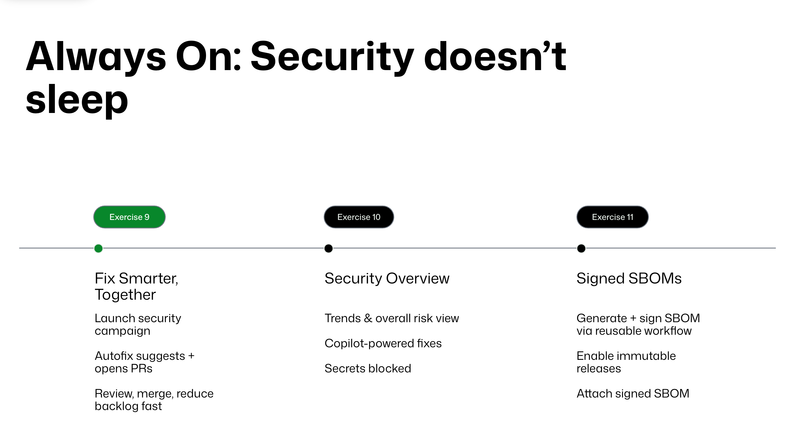

# Always On: Security doesn't sleep



## Exercise 9 - Fix Smarter, Together

Security campaigns are a way to group alerts and prioritize them with developers, so you can focus on remediation of those select vulnerabilities. In this lab we will create a security campaign for identified security alerts in the default branch and see how the Campaigns feature in GHAS will help encourage focussed remediation effort from development teams. With this feature you can fix security alerts at scale by creating security campaigns and collaborating with developers to burn down your security backlog.

For this exercise, we will use the Org level **Security** tab for creating **Campaigns**.

1. In GitHub, navigate to your Organization **Security** tab.
2. Click on the **Campaigns** menu in the left-hand pane.
3. Click on the **Create campaign** button.
4. Select **From template**.
5. In the subsequent menu, review the existing **Code** campaign templates:  
   1. Critical CodeQL Alert
   2. Mitre top 10 KEV
   3. SQL Injection
   4. Cross-site Scripting
6. Select **Critical CodeQL Alert**.
7. Click **Save as**, then select **Published campaign**.
8. Choose a due date for the campaign (e.g. two weeks from today).
9. Check the box to **Create issues for X repositories in this campaign**.
10. Select **Publish campaign**.

Challenge: Navigate back to the **Campaigns** tab and select the **Secrets** tab to view the existing **Secrets** campaign templates. Cancel and use the secret scanning alert filter to create a campaign based on the active, most commonly leaked secret type in your organization.

Read more about [security campaigns in our docs](https://docs.github.com/en/enterprise-cloud@latest/code-security/securing-your-organization/fixing-security-alerts-at-scale/about-security-campaigns).

## Exercise 10 - Security Overview

Now that you've enabled CodeQL code scanning, secret scanning with push protection, and Dependabot, it's time to see how your GitHub Organization's Security Overview helps you and your leadership team track security posture.

In this exercise, you'll answer a set of predefined questions from your fictional CISO by gathering data directly from the Security Overview dashboards.

### Step 1 - Open Security Overview

1. Navigate to your organization in GitHub.
2. In the top navigation, click Security.
3. You'll land on the Overview dashboard. This view summarizes alerts, trends, and feature adoption across your repositories.

### Step 2 - Answer the CISO's Questions

Use the following dashboards and metrics to find answers.

**Q1: "What percentage of our repositories have CodeQL, Dependabot, and Secret scanning enabled?"**

- Navigate to **Coverage**.
- Review the adoption cards at the top and note the percentages of repositories with each feature turned on.

**Q2: "How many open alerts do we currently have, and is the number going up or down?"**

- In **Overview** -> **Detection**, check the **Open alerts over time** graph.
- Change the time range to **Last 90 days**  
- Note the total open alerts, severity breakdown, and whether the trend indicator is rising or falling.

**Q3: "What is the average age of our remaining alerts?"**

- In Detection, find the **Age of alerts** metric.
- Report the number of days that alerts have been open on average.

**Q4: "Which repositories are contributing the most to our risk right now?"**

- Scroll down to **Impact analysis** -> **Repositories**.
- Identify the top repositories with the most open alerts.

**Q5: "Are we keeping up with remediating vulnerabilities?"**

- Switch to **Overview** -> **Remediation**.
- Check Closed alerts over time and Net resolve rate.
- Share whether you're closing alerts faster than new ones are being created.

**Q6: "How effective is push protection? Are developers bypassing it?"**

- Navigate to **Secret scanning insights**.
- Report how many secrets were blocked versus bypassed, and the most common reason for bypass.

Read more about [Security Overview in our docs](https://docs.github.com/en/enterprise-cloud@latest/code-security/security-overview/about-security-overview)

### Step 3 - (Optional) Deeper Dive

If you finish early, explore one or more of these areas:

- **Export data** - Use the Export CSV option to download current alert data for offline reporting.
- **Pull request alerts** - In **Overview** -> **Prevention**, review how many vulnerabilities were prevented in PRs vs. introduced.
- **Requests to bypass push protection** - If delegated bypass is enabled, check the Requests tab for open approvals.

## Exercise 11 - Signed SBOM

Frameworks like NIST SSDF, SLSA, and the EU Cyber Resilience Act (CRA) all emphasize software supply chain transparency. Common requirements across them include:

- NIST SSDF (PS.3.2): Collect and share provenance (SBOM).
- SLSA: Produce signed attestations for build provenance.
- CRA (Annex I Part II(1)): Mandate a machine-readable SBOM for all top-level dependencies.

The point is to give software consumers confidence that:

- The SBOM really came from the project's build system (authentic).
- The SBOM hasn't been tampered with (integrity).
- The SBOM describes exactly what was in the build (traceability).

In this exercise, we'll explore how to accomplish these goals all with the help of GitHub Actions, [Artifact Attestations](https://docs.github.com/en/enterprise-cloud@latest/actions/how-tos/secure-your-work/use-artifact-attestations/use-artifact-attestations), and the GitHub CLI.

### Step 1 - Generate an SBOM

We'll be working in the **mona-gallery** repo for this exercise. Start by adding the following step at the end of the **.github/release-attestation.yml** GitHub Actions workflow file to create an SBOM for each container image:

```yaml
- name: Generate SBOM for built image
  uses: anchore/sbom-action@v0.20.5
  with:
    image: ${{ env.IMAGE_PREFIX }}/${{ matrix.service.name }}@${{ steps.push.outputs.digest }}
    format: cyclonedx-json
    output-file: ${{ matrix.service.name }}-sbom.cdx.json
    upload-artifact: false
    upload-release-assets: false
```

### Step 2 - Sign & Attest the SBOM

Build on the same workflow file by adding a step to sign the SBOM and link it to your container image:

```yaml
- name: Attest SBOM
  uses: actions/attest-sbom@v3.0.0
  with:
    subject-name: ${{ env.IMAGE_PREFIX }}/${{ matrix.service.name }}
    subject-digest: ${{ steps.push.outputs.digest }}
    sbom-path: ${{ matrix.service.name }}-sbom.cdx.json
    push-to-registry: true
```

Open a pull request and merge these new changes into the `main` branch.

### Step 3 - Create a release

Next, create a **v1.0.0** tag to trigger a release:

- Option 1: From the CLI  
  - Clone the repo locally: `git clone https://github.com/ORG/REPO.git`  
  - Create a tag: `git tag v1.0.0`  
  - Push the tag to the remote repository: `git push origin v1.0.0`  
- Option 2: From the UI  
  - Next to the `main` branch dropdown, click on **0 tags**  
  - Select **Create a new release** (if you don't see this button, select the **Releases** tab)  
  - In the **Select tag** dropdown, type **v1.0.0**, then select **Create new tag: v1.0.0**  
  - Select **Publish release**

Navigate to the Actions tab to ensure a workflow was triggered by the new tag. **While the workflow runs, complete Step 4\.**

### Step 4 - Connect to [ghcr.io](http://ghcr.io) locally

Create a personal access token with the **read:packages** scope:

- Navigate to [https://github.com/settings/tokens](https://github.com/settings/tokens)
- Click **Generate new token** -> **Generate new token (Classic)**  
- Select the **read:packages** checkbox  
- Click the **Generate token** button
- Next to the token value, select **Configure SSO**, then select **Authorize** next to your organization
- Copy the token value to your clipboard

In your terminal, run the following command to authenticate to [ghcr.io](http://ghcr.io):

```bash
docker login ghcr.io -u <YOUR_HANDLE>@github.com
```

When prompted, paste in the personal access token. This will allow the GitHub CLI to reach out to [ghcr.io](http://ghcr.io) on your behalf to fetch the container image details.

### Step 5 - Verify the attestation

In order to fetch the attestations for a given image, we need to authenticate with an account that has access to do so.

Run the following command to authenticate the GitHub CLI with your account:

```bash
gh auth login
```

For easier copy/paste throughout the next few steps, set an environment variable equal to your organization name:

MacOS:
  
```bash
export GITHUB_ORG=<YOUR_ORG_NAME>
```

Windows:

```bash
set GITHUB_ORG=<YOUR_ORG_NAME>
```

*Pause* - ensure that the Actions workflow from earlier has completed successfully.

Confirm the origin details for one of the newly released container images, **auth v1.0.0**:

MacOS:

```bash
gh attestation verify oci://ghcr.io/$GITHUB_ORG/auth:1.0.0 --owner $GITHUB_ORG --predicate-type https://cyclonedx.org/bom
```

Windows:

```bash
gh attestation verify oci://ghcr.io/%GITHUB_ORG%/auth:1.0.0 --owner %GITHUB_ORG% --predicate-type https://cyclonedx.org/bom
```

Review the SBOM details for the newly released **auth v1.0.0** container image:

MacOS:

```bash
gh attestation verify oci://ghcr.io/$GITHUB_ORG/auth:1.0.0 --owner $GITHUB_ORG --predicate-type https://cyclonedx.org/bom --format json --jq '.[].verificationResult.statement.predicate'
```

Windows:

```bash
gh attestation verify oci://ghcr.io/%GITHUB_ORG%/auth:1.0.0 --owner %GITHUB_ORG% --predicate-type https://cyclonedx.org/bom --format json --jq '.[].verificationResult.statement.predicate'
```

This exercise moves the storyline from **scanning code for vulnerabilities** to **proving your supply chain is trustworthy**. You've now established the foundation for **transparent and verifiable software consumption**.

Read more about [artifact attestations in our docs](https://docs.github.com/en/enterprise-cloud@latest/actions/how-tos/secure-your-work/use-artifact-attestations/use-artifact-attestations).

## Security Passport checkpoint

Return to the [Security Passport](security-passport.md) and mark off the remaining sections. You should have completed the following stamps:

- [x] 3. Release with integrity
- [x] 4. Keep the receipts
- [x] 8. Handle vulns like a pro
- [x] 10. Trust your builds
- [x] 11. Track and report

Congratulations, we've completed our security _world tour_! 🚀
